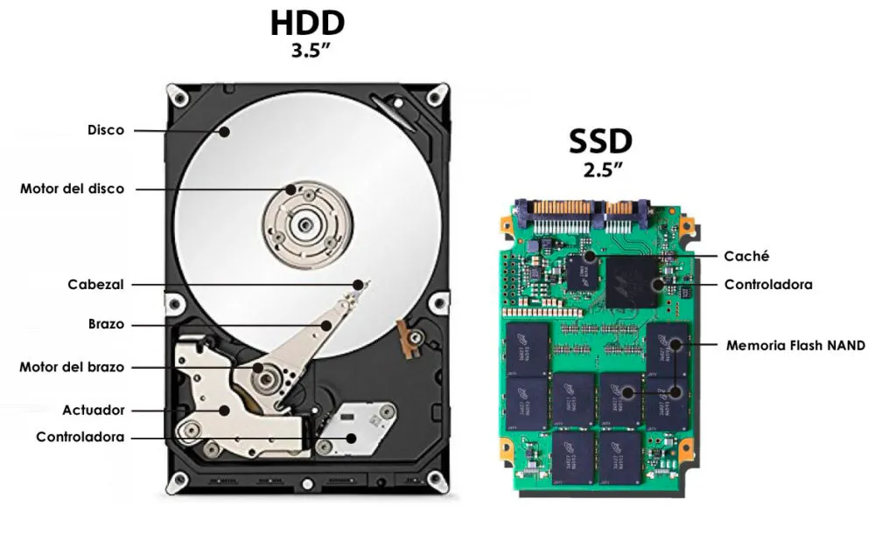

# Intoducción, conceptos generales

# # Disco duro

**Tipos de discos duros**

- **HDD (Hard Drive Disk)**: Mecánicos
- Unidad de estado sólido o SSD
  - Conexión SATA o PCIe
  - Conexión NVME m.2

# 2. Particiones disco duro

## Una partición

## Varias particiones

## Tipos de particiones

Independientemente del sistema de archivos de una partición (FAT, NTFS, ext3, ext4, etc.), si se habla de un disco duro que use MBR, existen 3 tipos diferentes de particiones:

**Partición primaria**. Son las divisiones primarias del disco. En un disco duro, pueden existir de una a cuatro particiones primarias o hasta tres primarias y una extendida. Depende de una tabla de particiones. Un disco duro físico completamente formateado (por ejemplo, una unidad de disco duro externa USB nueva) consiste, en realidad, en una partición primaria que ocupa todo el espacio del disco y posee un sistema de archivos. Prácticamente, cualquier sistema operativo puede detectar este tipo de particiones primarias, y asignarles una unidad, siempre y cuando el sistema operativo reconozca su formato (sistema de archivos).

**Partición extendida.** También conocida como partición secundaria, es otro tipo de partición que actúa como una partición primaria; sirve para contener múltiples unidades lógicas en su interior. Fue ideada para romper la limitación de 4 particiones primarias en un solo disco físico. Solo puede existir una partición de este tipo por disco, y solo sirve para contener particiones lógicas. Por lo tanto, es el único tipo de partición que no soporta un sistema de archivos directamente.

**Partición lógica.** Ocupa una porción de la partición extendida o la totalidad de la misma, y se ha formateado con un tipo específico de sistema de archivos (FAT32, NTFS, ext3, ext4, etc.) y se le ha asignado una unidad, así el sistema operativo reconoce las particiones lógicas o su sistema de archivos. Se pueden tener un máximo de 23 particiones lógicas en una partición extendida. Aunque algunos sistemas operativos pueden ser más restrictivos, como Linux que impone un máximo de 15, incluyendo las 4 primarias, en discos SCSI y en discos IDE 8963.

El número de particiones que puede crear en un disco básico depende del estilo de partición del disco:

- En los discos con registro de inicio maestro (MBR) se pueden crear hasta cuatro particiones primarias por disco o bien se pueden crear hasta tres particiones primarias y una partición extendida. Dentro de la partición extendida se pueden crear un número ilimitado de unidades lógicas.
- En los discos con tabla de particiones GUID (GPT) se pueden crear hasta 128 particiones primarias. Con GPT no existe la limitación a cuatro particiones primarias por lo que no es necesario crear particiones extendidas ni unidades lógicas. [32]

## Programas para realizar particiones

**GParted**

**cfdisk (consola) o fdisk**

**Gestor de disco Windows**

**Utilidad de discos Mac OS**

# 3. Sistema de archivos

Un sistema de archivos indexa toda la información de los datos en un dispositivo de almacenamiento, incluyendo el tamaño del Archivo, los atributos, la ubicación y la jerarquía en el directorio. El sistema de archivos también especifica la ruta a un archivo mediante la estructura de directorios con un formato.

- **Sistema de archivos de Windows** - FAT, NTFS, exFAT
- **macOS** - HFS, APFS, HFS+
- **Linux -** EXT2/3/4, XFS, JFS, Btrfs

Comparativa deferentes sistemas de ficheros.

<aside> ⚠️ Falta tamaño del bloque, para compararlo con el tamaño del bloque de HDFS.

</aside>

| **Diferencias**                                              | **Tamaño máximo del archivo**                    | **Tamaño máximo de volumen** | **Sistema operativo**                                        |
| ------------------------------------------------------------ | ------------------------------------------------ | ---------------------------- | ------------------------------------------------------------ |
| NTFS                                                         | • 16EB - 1KB                                     |                              |                                                              |
| • 16TB - 64KB                                                |                                                  |                              |                                                              |
| • 256TB - 64KB                                               |                                                  |                              |                                                              |
| • 8PB - 2MB                                                  | • 256TB - 64KB                                   |                              |                                                              |
| • 8PB - 2MB                                                  | • Windows NT3.1 y posterior                      |                              |                                                              |
| • macOS X 10.3 y posterior (Sólo lectura)                    |                                                  |                              |                                                              |
| • Núcleo Linux 2.6 y posterior (sólo lectura)                |                                                  |                              |                                                              |
| • FreeBSD, NetBSD, OpenBSD(sólo lectura), Chrome OS, Solaris, ReactOS(sólo lectura) |                                                  |                              |                                                              |
| FAT32                                                        | **• 4GB**                                        | • 2TB - 512 bytes            |                                                              |
| • 8TB - 2KB                                                  |                                                  |                              |                                                              |
| • 16TB - 4KB                                                 | • Windows 95OSR2, Windows 98, XP, 7, 8, 10 y 11. |                              |                                                              |
| • macOS                                                      |                                                  |                              |                                                              |
| • Linux                                                      |                                                  |                              |                                                              |
| exFAT                                                        | • 128 PB                                         | • 128 PB                     | • Windows XP, Vista, 1/8/10/11, Windows Server 2003/2008/2008 R2 |
| • Kernal Linux 5.4 y posterior, FUSE                         |                                                  |                              |                                                              |
| • Mac OS X 6.5 y posterior                                   |                                                  |                              |                                                              |
| EXT2/3/4                                                     | • 4TB - 1KB                                      |                              |                                                              |
| • 8TB - 2KB                                                  |                                                  |                              |                                                              |
| • 16TB - 4KB                                                 |                                                  |                              |                                                              |
| • 256PB - 64KB                                               | • 4TB - 1KB                                      |                              |                                                              |
| • 8TB - 2KB                                                  |                                                  |                              |                                                              |
| • 16TB - 4KB                                                 |                                                  |                              |                                                              |
| • 256PB - 64K                                                | • Núcleo Linux 0.96 y posterior                  |                              |                                                              |

# 4. Configuración red Virtualbox

|                      | **VM ↔ HOST** | **VM1 ↔ VM2** | **VM → INTERNET** | **VM ← INTERNET**  |
| -------------------- | ------------- | ------------- | ----------------- | ------------------ |
| **Solo anfitrión**   | **SI**        | **SI**        | NO                | NO                 |
| **Interna**          | NO            | **SI**        | NO                | NO                 |
| **Adaptador puente** | **SI**        | **SI**        | **SI**            | **SI**             |
| **NAT**              | NO            | NO            | **SI**            | Reenvío de puertos |
| **Red NAT**          | NO            | **SI**        | **SI**            | Reenvío de puertos |

El modo que nos da más flexibilidad sería el adaptador puente, mientras que el resto serían más restrictivos.

- El **adaptador puente** hace que la máquina virtual se conecte a la misma red que el anfitrión, de tal forma que la MV se comportará como si fuera un PC más conectado a la red real. Nos permite conectar entre MV, desde el anfitrión, y a Internet bidireccionalmente. Por contra, nos puede ocasionar problemas puesto que estará conectado a la red real (especialmente en caso de montar servidores).
- En **modo solo anfitrión** podremos conectarnos desde el anfitrión a nuestras máquinas virtuales y viceversa, así como conectar entre máquinas virtuales. En todo caso, no tendremos por defecto conexión a internet (ni de salida ni de entrada)
- El **modo NAT** sería todo lo contrario al modo anterior. Las máquinas virtuales tendrían salida a internet, pero para poder conectar desde internet se tendrían que mapear puertos mediante NAT. No podríamos conectarnos entre diferentes máquinas virtuales.
- Para poder conectar también entre máquinas virtuales existe el **modo red NAT**, que añade a las características del modo NAT.
- El **modo interno** sería el más restringido, permitiendo únicamente conexión entre las máquinas virtuales. No podríamos conectar desde el anfitrión a las MV, ni tendríamos salida a Internet desde las MV.